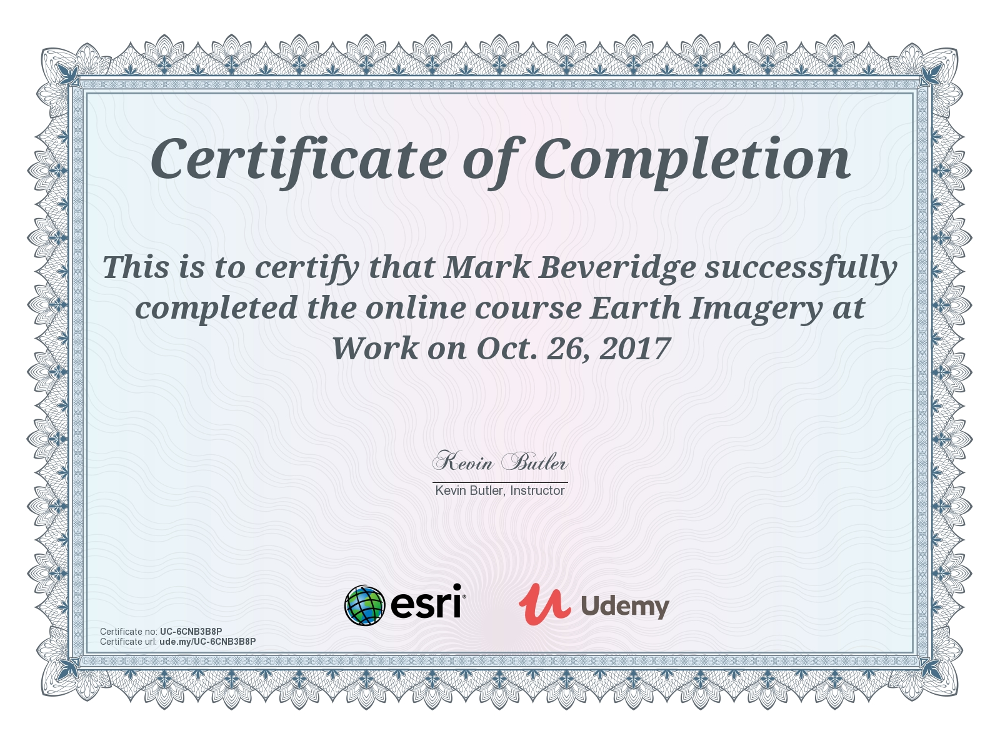

# Esri's MOOC Program : "[Earth Imagery at Work](http://www.esri.com/mooc/imagery)"
###### 6/9/17 - 17/10/17

## See why imagery is information
Digital images of earth’s surface produced by remote sensing are the basis of modern mapping. They are also used to create valuable information products across a spectrum of industries. This free online course is for everyone who is interested in applications of earth imagery to increase productivity, save money, protect the environment, and even save lives.

## Syllabus
### Section 1 : Overview of the Course and Imagery
Imagery is increasingly integrated in the decision making process across many industries. The analysis of imagery is an efficient way to gain information that saves time, money and resources. In this course we will talk about applications of imagery and image analysis to provide solutions to challenges faced in various industries.

### Section 2 : Imagery in Agriculture: "The Crop Doctor is in"
It’s more than hoping, praying, planting, wishing these days for agriculture. Learn how imagery can add another dimension to farmers’ in-depth knowledge of their land with information only available through remotely sensed data.

### Section 3 : Imagery in Environmental: "Understand the World Around you"
Seeing is believing. Remotely sensed data enables you to understand large scale global changes over time that impact our world. Learn to identify and quantify changes in vegetation.

### Section 4 : Imagery in Disaster "Management: Plan, Prepare, Act"
Explore how imagery is used prior to events to predict and prepare, during events to mobilize people and resources and make decisions, and after events to mitigate subsequent problems. Create maps and web apps designed to quickly disseminate information to decision makers.

### Section 5 : Imagery in Utilities: "Keeping the Public Happy"
Whether we are talking about poles, pipes or water tanks, the public expects to have their lights on, gas flowing and clean water. Discover how imagery helps utilities work more efficiently and provide reliable service.

### Section 6 : Imagery in Insurance: "Risky Business"
The world is unpredictable, and imagery can help insurance companies understand risks, make proactive decisions and uncover fraud. Explore factors considered in risk analyses and factors that contribute to the damage reported in insurance claims.

### Section 7 : Imagery in Commercial: "Why Are You Watching Me"
Imagery helps businesses find customers, monitor competition and market effectively. Explore how imagery and demographic data integrate to provide insights for successful businesses.

